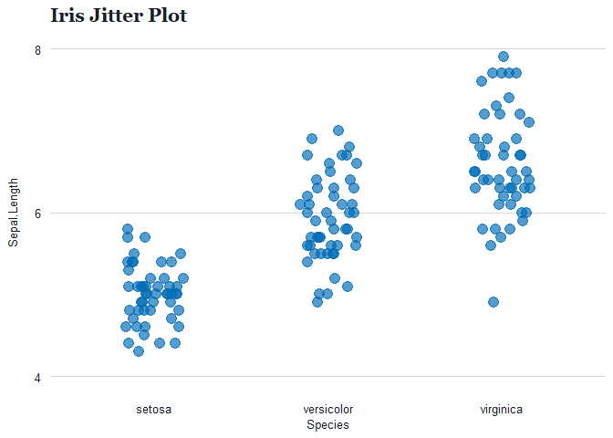

<!-- README.md is generated from README.Rmd. Please edit that file -->

# smcepi

<!-- badges: start -->
<!-- badges: end -->

The goal of smcepi is to provide functions that make data analysis
easier for San Mateo County epidemiologists.

## Installation

You can install the development version of smcepi from
[GitHub](https://github.com/) with:

``` r
# install.packages("devtools")
devtools::install_github("San-Mateo-County-Health-Epidemiology/smcepi")
```

## Using `theme_gg_smc()`

`theme_gg_smc()` will format your `ggplot2` charts according to OEE
style guidelines. In order to use the county’s fonts, you’ll need to run
`load_smc_fonts()` once per session so that the fonts are available for
use in the `theme_gg_smc()` function.

``` r
library(smcepi)
#> Loading required package: ggplot2

load_smc_fonts()
#> [1] "You already have Arial and Georgia. You're good to go!"

iris %>% 
  ggplot(aes(x = Species, 
             y = Sepal.Length)) +
  geom_point(
    position = position_jitter(w = 1/6, h = 0),
    size = 4, 
    color = "#006cb6", 
    alpha = 2/3
  ) +
  scale_y_continuous(
    limits = c(4, 8),
    breaks = seq(4, 8, 2)
  ) + 
  labs(title = "Iris Jitter Plot") + 
  theme_gg_smc()
```


